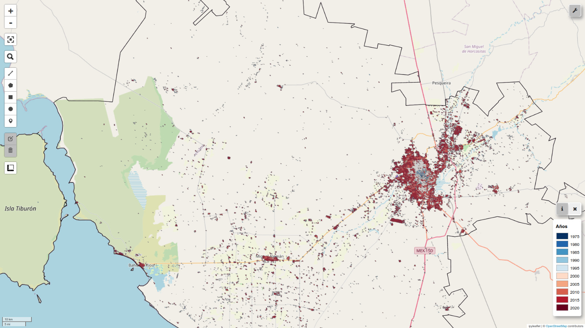

# Hi, I'm Manuel Solano  🤟 (he/his)

*B.S. in Data Science and Mathematics Engineering in [Instituto Tecnológico y de Estudios Superiores de Monterrey](https://tec.mx/es)*

*Data Science Intern at [URSA](https://github.com/EL-BID/URSA)*    

     

## About me

I'm from Mexico 🇲🇽, a country where nearly half of the population lives in poverty, where crime and violence constitute a daily reality for too many, where environmental pollution threatens our health, and where corruption has eroded trust in our institutions. 

Even though things may seem discouraging, I like to believe that we have what it takes to make a difference. We have the resources, the tools, and the dialogue. Yet, we must collaborate, combine our talents to create a better world. In the words of Salvador Allende, "To put an end to this brutal reality, committed professionals dedicated to social change are required." [^1].

Unfortunately, not everyone has the same opportunities to harness their talents. I understand that having access to school and access to knowledge - and therefore power - is a privilege. And I am one of those who believe that privileges only make sense and become virtues when they are placed in the service of others, especially those in need. That is why, as a Data Scientist, my ultimate goal is to __*use data as a tool for empowerment rather than oppression*__ [^2].

I work every day to become the professional required to address the most urgent challenges of our times, and I am eager to connect with people who share the same passion as I do. Even if you are not related to data or technology, we can still collaborate then, especially then because only through interdisciplinary collaboration can we address such complex and multifactorial problems.

Feel free to contact me and we can start a project :)

## My work

I've been working on analyzing the urban growth in Metropolitan Areas of Mexico.

  

*Urban growth in Metropolitan Zone of Hermosillo 1975 - 2020*

__*“Educate yourselves because we will need all your intelligence. Be excited because we will need all your enthusiasm. Organise because we will need all your strength.”*__ 
*- Antonio Gramsci*

[^1]: Speech delivered by Salvador Allende at the University of Guadalajara (1970).
[^2]: Sarah Wiliam. "Data Action" (2022).

